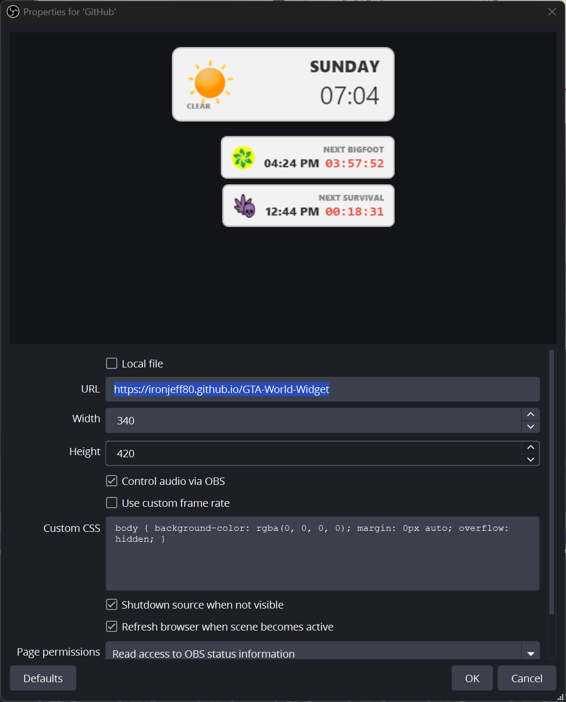

# 🚗 GTA Widget for OBS
> **The ultimate real-time game clock, weather tracker, and seasonal event manager for GTA streamers.**


This is a high-performance, real-time overlay designed for the GTA community. It features a perfectly calibrated game-time clock, a massive 384-hour weather loop synchronization, and automated seasonal event tracking (Bigfoot, Slashers, etc.) with deep Streamer.bot integration.

---

## 📸 Preview


---

## ✨ Features
* ⏳ **Calibrated Game Clock:** Highly accurate time logic (2 seconds per game minute) synced to Unix time for perfect alignment with game day cycles.
* ☁️ **Weather Forecasting:** Predicts upcoming weather conditions based on a massive 384-hour loop schedule, with a toggleable "Next Weather" preview.
* 🎃 **Seasonal Modules:** Intelligent logic for special events like **420 Week** (Bigfoot tracking) and **Halloween** (Slasher spawns) that activate/deactivate automatically.
* 🔊 **Dynamic Audio Alerts:** Integrated spatial sound effects for rare spawns (e.g., Sasquatch growls and Survival alerts) that trigger the moment an event goes active.
* 🧪 **System Diagnostics:** Built-in debug panel (toggleable) to monitor Unix time, local sync, and loop positions in real-time.
* 🎨 **GTA Aesthetic:** Minimalist, professional UI with clean icons and a dynamic Halloween "Spooky" theme that activates during night hours.

---

## 🛠️ Setup Instructions

### 1. OBS Browser Source Setup
* **Add Source:** Create a new **Browser Source** in OBS.
* **URL:** Point it to https://ironjeff80.github.io/GTA-World-Widget or your forks hosted GitHub Pages URL.
* **Dimensions:** Set Width to **340** and Height to **420**
* **Audio:** Check **"Control Audio via OBS"** to manage the alert volume through your OBS mixer.
* **Sync:** Check **"Shutdown source when not visible"** and **"Refresh browser when scene becomes active"** to ensure the clock is always calibrated when you switch scenes.


### 2. Streamer.bot Integration (Make your own Fork of this repo)
* **WebSocket:** Ensure your Streamer.bot server is running on `127.0.0.1:8080` (default).
* **Automated Actions:** The widget triggers specific Action IDs for seasonal spawns (Yeti, Gooch, etc.) based on the in-game schedule.
    * Edit this section in the `index.html`. Set the time you want the action to fire and your action ID:
      ```javascript
      const triggerSchedule = {
          "21:00": { name: "Yeti", actionId: "PASTE_YETI_ID" },
          "03:00": { name: "Gooch", actionId: "PASTE_GOOCH_ID" },
          "12:00": { name: "Snowman", actionId: "PASTE_SNOWMAN_ID" }
      };
      ```
* **Chat Integration:** The widget sends automated chat messages to your audience via Streamer.bot when rare events are spotted.

### 3. Customization (Settings Section if using your own fork)
Edit the top of the `index.html` file to toggle your preferences:
* `SHOW_DIAGNOSTICS`: Toggle the technical system diagnostics box.
* `SHOW_NEXT_WEATHER`: Show or hide the upcoming weather prediction box.
* `CURRENT_SEASON`: Set your active season (`420WEEK`, `HALLOWEEN`, or `CHRISTMAS`).

---

## 📜 Credits
* **Typography:** Segoe UI & Monospace for high readability.
* **Logic:** Built by 2SmokinBarrels for the GTA Online streaming community.
* **Assets:** Custom weather icons and high-quality event audio triggers.